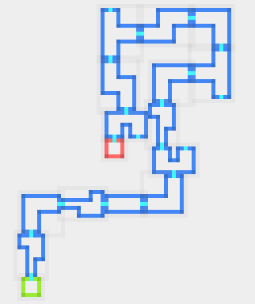

# dgen

Library to blueprint and procedurally generate dungeons.

# Usage

First put following dependencies into your `pom.xml`:

```xml

<dependencies>
    <!-- For the actual generation -->
    <dependency>
        <groupId>network.cow.dgen</groupId>
        <artifactId>dgen-core</artifactId>
        <version>0.1.0</version>
    </dependency>

    <!-- For displaying the dungeon -->
    <dependency>
        <groupId>network.cow.dgen</groupId>
        <artifactId>dgen-visuals</artifactId>
        <version>0.1.0</version>
    </dependency>
</dependencies>
```

Now you can simply load the blueprints, generate a seed and let the generator do the work for you:

```kotlin
// load the blueprint sprites
val spriteSheetImage: BufferedImage
val blueprints = ImageRoomBlueprintLoader(spriteSheetImage, gridSize = 16).load()

val seed = generateSeed()
val generator = SinglePathDungeonGenerator(seed, rooms, pathLength = 15)

val generatedRooms: List<DungeonRoom> = generator.generate()
// do something with the generated rooms.
```

For this example we used the simplest form of generator: The `SinglePathDungeonGenerator`. With that, a room will only connect to the previous and next one. Now let's just display the
dungeon, that we've created:

```kotlin
val visualizer = DungeonVisualizer(*generatedRooms.toTypedArray())
JOptionPane.showMessageDialog(null, visualizer)
```

And done. The application should now show something like the following:


